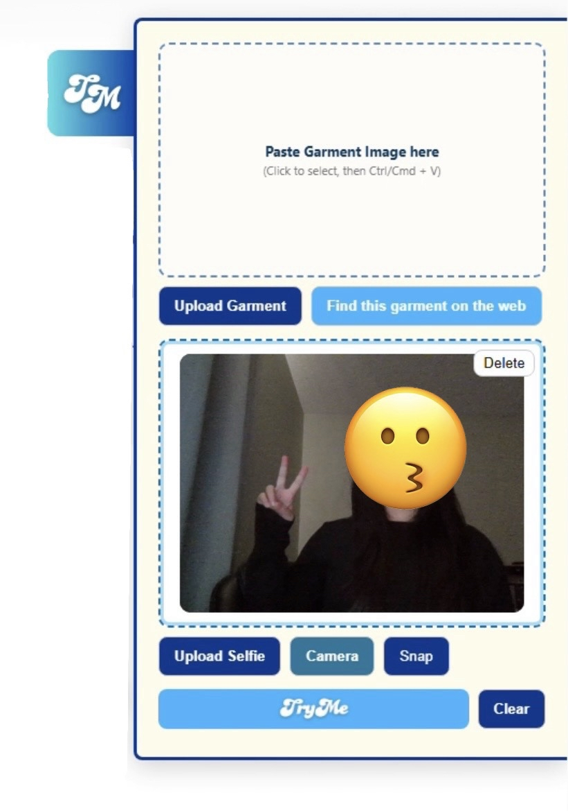

# TryMe — Virtual Try-On Chrome Extension


---

## Overview

**TryMe** is a Chrome extension that lets users virtually try on clothing directly on any shopping website.  
Powered by the **IDM-VTON** deep learning model (via Hugging Face), the extension allows users to:

- Paste or upload a garment image  
- Paste/upload/snap a selfie  
- Generate a virtual try-on preview  
- Reverse-search the garment on Google Lens  
- Use drag-to-move UI and live camera integration  

---

## Gallery

<div style="overflow-x: auto; white-space: nowrap; padding-bottom: 10px;">
  
  
  
  
</div>

---

## Inspiration

TryMe was originally inspired by my team's **NatHacks 2025** hackathon project.  
The goal was to create a lightweight, virtual try-on tool to reduce clothing waste while shopping online.

Check out the original project:

Live website: **[Emergrade on Render](https://emergrade-a0wx.onrender.com)** 

Devpost: **[Devpost Page Here](https://devpost.com/software/emergrade)**

---

## Installation (Developer Mode)

1. Clone the repo 
```bash
git clone https://github.com/JeremelleV/TryMe
```
2. Open Chrome → Extensions → enable Developer Mode
3. Click "Load unpacked"
4. Select this repository folder
5. The TryMe panel will appear on the right side of any webpage

---

## How It Works

### Frontend (Chrome Extension)
- Shadow DOM UI
- Paste, drag, upload, camera capture
- Temporary image display
- Reverse image search using Google Lens
- Sends data URLs to backend via Chrome messaging

### Backend (Render)
- Receives garment and selfie images
- Sends both to IDM-VTON on Hugging Face
- Returns generated virtual try-on image
- Hosts temporary garment images for Google Lens search
- Returns a mock preview when free-tier HF quota is exhausted

---

## Hugging Face Token & Quota Caveats

The extension relies on the Hugging Face ZeroGPU free tier.

Important notes:
- Daily GPU minutes are limited
- IDM-VTON may still treat API calls as anonymous even with a token
- When quota is exceeded:
  - Backend returns a mock result
  - 
- Quota resets every 24 hours
- Best workaround: fork IDM-VTON into your own HF account

---

## Google Reverse Image Search

The extension supports garment reverse-search via Google Lens.

Notes:
- Implemented using "lens.google.com/uploadbyurl?url=<image>"
- Feature works as of version 1.0 (2025-11)
- Google may change Lens APIs at any time
- Uploaded images are temporarily hosted under /public/reverse/ on the backend

---

## Backend (Node + Express)

TryMe uses a minimal Node/Express backend built specifically to:

- Accept garment + selfie images from the extension
- Send them to IDM-VTON using the official `@gradio/client`
- Normalize the Space output
- Return a browser-ready image to the extension

### Backend Repository  
🔗 **[TryMe Backend](https://github.com/JeremelleV/TryMe-backend)**

### Deployment Notes  
The backend is deployed on **Render (free tier)**.  
This means:

- If the service has been idle, it may take **20–40 seconds** to spin up  
- During cold starts, the extension may temporarily fall back to the mock image

Once warm, results are generally fast.

---

## Model Credit — yisol/IDM-VTON

All virtual try-on results are generated using the excellent open-source model licensed under the Creative Commons Attribution-NonCommercial-ShareAlike 4.0 License:

### **IDM-VTON on Hugging Face**  
🔗 https://huggingface.co/spaces/yisol/IDM-VTON  

### **GitHub Repository**  
🔗 https://github.com/yisol/IDM-VTON  

This extension does **not** modify or distribute model weights.  
All inference calls go directly through the publicly available **Hugging Face Space API** using the `@gradio/client` library.

If you use or extend this project, please credit **yisol et al.** for their work.

